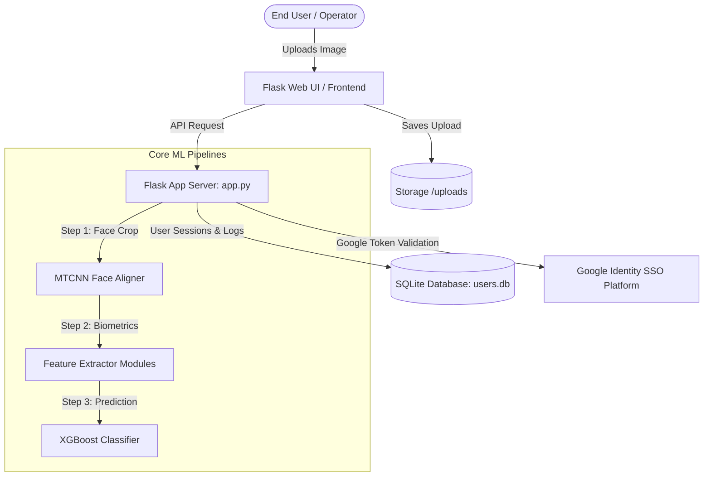

# Veritas-AI (Aegis-AI) - DeepFake Detection System

This document serves as the absolute, single source of truth for the **Veritas-AI** (internally branded as **Aegis-AI**) forensic platform. It outlines the core system design, the three distinct processing pipelines, biometric feature extraction details, user security frameworks, Hugging Face Spaces Docker SDK configurations, and UI/UX design components.

* **Live Production URL:** [https://aditya150-veritas-ai.hf.space/](https://aditya150-veritas-ai.hf.space/)
* **Contact:** 245123737184@mvsrec.edu.in

---

## 1. High-Level System Architecture

Veritas-AI is an enterprise-grade deepfake detection system structured in a decoupled web service architecture. The platform combines advanced computer vision models (convolutional models, auto-encoders, and vision transformers) with classical digital image forensics to isolate fake face structures.



---

## 2. The Three Pipeline Architectures

The project contains three distinct pipelines designed for different stages of the project life-cycle (production inference, R&D deep training, and legacy heuristic model-weighted analysis).

### Pipeline A: Production-Grade XGBoost Fusion Engine (Active)
This is the live pipeline driving the Flask web application ([app.py](file:///d:/ANTIGRAVITY/app.py)) and the command-line inference tool ([predict_fusion.py](file:///d:/ANTIGRAVITY/predict_fusion.py)).
* **Design Philosophy:** Real-time, fast, and resource-efficient. It avoids running full heavyweight deep models on every API request. Instead, it extracts **nine key scalar scores** from the face crop and feeds them to a pre-trained **XGBoost classifier**.
* **Model Files:** 
  * [fusion_engine_best.json](file:///d:/ANTIGRAVITY/dataset/fusion_engine_best.json) — Plain-text JSON containing the serialized gradient-boosted decision trees.
  * [scaler.json](file:///d:/ANTIGRAVITY/dataset/scaler.json) — Normalization mean, variance, and scale factors used by `StandardScaler` to clean input features before prediction.

### Pipeline B: Deep Multi-Modal Cross-Attention Network (R&D V2)
A high-capacity, multi-branch deep neural network architecture located in [core/v2_architecture.py](file:///d:/ANTIGRAVITY/core/v2_architecture.py) and trained via [train.py](file:///d:/ANTIGRAVITY/train.py).
* **Architecture Branches (Pillars):**
  1. **Spatial Domain Branch:** Utilizes a `Swin-T` transformer (`swin_tiny_patch4_window7_224` via `timm`) on resized $224 \times 224$ images to learn spatial anomalies and splice boundaries.
  2. **Frequency Domain Branch:** Utilizes a `ResNet-18` backbone modified for 1-channel inputs to process 2D Fast Fourier Transform (FFT) log-magnitude spectrums.
  3. **Latent Fingerprint Branch:** A 3-layer CNN with batch normalization and adaptive max pooling that processes auto-encoder reconstruction error maps ($E = |I_{input} - I_{recon}|$).
  4. **Statistical Realism Branch:** A two-layer MLP with layer normalization that maps a flat 8192-dimensional Local Binary Pattern (LBP) and texture entropy vector.
* **Feature Fusion:** Project all branch representations to 512 dimensions. The Spatial Branch output acts as the **Query ($Q$)**, while the Frequency, Latent, and Statistical branches are stacked to serve as **Keys ($K$)** and **Values ($V$)** inside an **8-head Multi-Head Cross-Attention** layer.
* **Loss Function:** Optimized via a **Compound Loss** combining Binary Cross-Entropy (BCE) with Supervised Contrastive Loss to separate real and fake clusters in the latent representation space.

### Pipeline C: Heuristic Multi-Model Hybrid Pipeline (Legacy / Ensemble)
Located in [core/pipeline.py](file:///d:/ANTIGRAVITY/core/pipeline.py) and [core/fusion.py](file:///d:/ANTIGRAVITY/core/fusion.py).
* **Functionality:** Aggregated multiple independent analyzer classes (Local EfficientNet-B3, External APIs, FFT analyzer, LBP texture analyzer, landmark symmetry checks) using static, weighted thresholds:
  * External API Score: 40%
  * Local Custom Model: 40%
  * FFT Frequency Analysis: 10%
  * LBP Texture Analysis: 5%
  * Landmark Symmetry Analysis: 5%

---

## 3. The 9 Production Forensic Metrics

When an image is submitted to the production pipeline, the system extracts nine distinct biometric and digital artifacts:

1. **Spatial Artifact Score (`spatial_score`)**
   * *Method:* Computes the mean of the absolute values of the normalized aligned face tensor.
   * *Target:* Detects general pixel-level color, lighting, or structural anomalies.
2. **Frequency Anomaly Score (`freq_score`)**
   * *Method:* Converts the face crop to grayscale, executes a 2D Fast Fourier Transform (FFT), shifts the low frequencies to the center, takes the log-magnitude, and sums the energy in the outer 25% boundary margins.
   * *Target:* Exposes generative upsampling footprints (checkerboard footprints) left by GANs/Diffusion models.
3. **Noise Residual Score (`latent_score`)**
   * *Method:* Feeds the face crop into a Tiny Auto-Encoder for Stable Diffusion (TAESD) reconstruction loop, and calculates the mean absolute difference ($E = |I_{input} - I_{recon}|$).
   * *Target:* Identifies whether the face matches diffusion-based reconstruction manifolds (synthetic textures reconstruct with lower error rates than real high-frequency human skin details).
4. **Embedding Consistency (`stat_score`)**
   * *Method:* Extracts Local Binary Patterns (LBP) and localized texture descriptors, returning the mean density.
   * *Target:* Detects micro-texture anomalies and unnatural smoothness in facial skin.
5. **Entropy Score (`entropy`)**
   * *Method:* Computes the Shannon entropy of the grayscale face crop using `skimage.measure.shannon_entropy`.
   * *Target:* Gauges the overall information complexity of the face (fake images often have flat regions resulting in low entropy).
6. **Edge Density Score (`edge_density`)**
   * *Method:* Runs a Canny edge detector (thresholds 100 and 200) and counts the ratio of edge pixels to total pixels.
   * *Target:* Detects unnatural sharp boundaries, splicing lines, or lack of details.
7. **Laplacian Variance Score (`laplacian_variance`)**
   * *Method:* Applies a Laplacian operator on the grayscale face and calculates its variance.
   * *Target:* Measures face blurriness and camera focus details (low values indicate blurred regions or artificial smoothing).
8. **Color Kurtosis Score (`color_kurtosis`)**
   * *Method:* Computes the kurtosis of the pixel distributions across the R, G, and B color channels, then averages them.
   * *Target:* Evaluates statistical anomalies in color distributions and unnatural channel shifts.
9. **JPEG Consistency Score (`jpeg_consistency`)**
   * *Method:* Computes the 2D discrete cosine transform (DCT) over the entire face crop, masks out the low-frequency $8 \times 8$ corner coefficients, and measures the variance of the remaining coefficients.
   * *Target:* Detects double-compression artifacts and compression inconsistencies typical of edited/manipulated images.

---

## 4. Production Web Portal Security & Features

The Flask web service is built with strict security policies to protect the deepfake detection core:

* **Session Management & HF Proxy Fix:** Fully configured to run behind reverse proxies (like Hugging Face Spaces). Session cookies are set to `SameSite=None` and `Secure=True` via `ProxyFix` middleware to prevent session deletion inside cross-origin iframes.
* **SQLAlchemy Database Schema:** Holds user data (`users.db`) using the following layout:
  ```python
  class User(UserMixin, db.Model):
      id = db.Column(db.Integer, primary_key=True)
      username = db.Column(db.String(150), unique=True, nullable=False)
      email = db.Column(db.String(150), unique=True, nullable=True)
      password_hash = db.Column(db.String(300), nullable=True)
      google_id = db.Column(db.String(150), unique=True, nullable=True)
      last_username_change = db.Column(db.DateTime, nullable=True)
      ai_data_optin = db.Column(db.Boolean, default=False, nullable=True)
  ```
* **Authentication Gatekeeping:**
  * *Password Complexity Rules:* Minimum 8 characters, at least 1 uppercase letter, 1 lowercase letter, 1 number, and 1 special character.
  * *Rate Limiting Lockout:* tracks failed logins in-memory per IP address. 5 failed login attempts will lock the IP out of the authentication gateway for **5 hours**.
  * *Google SSO Login:* Verifies Google JWTs natively using `google.oauth2.id_token`. Automatically handles username conflicts (e.g., appends indexes if the email prefix is already registered) and sets an initial bypass so users can change auto-generated usernames immediately.
* **Data Control & Cooldowns:**
  * *Username Modification Lockout:* Users can update their usernames at most **once every 7 days** to prevent active operator identification masking.
  * *AI Data Sharing Opt-in:* A toggle allowing operators to control whether their uploaded images can be utilized for retraining forensic modules.
* **Admin Override Panel:**
  * Restricted exclusively to `adityajadhav300405@gmail.com`.
  * Visualizes the registered user database, authentication methods, and opt-in parameters.
  * Permits account deletion. On deletion, it simulates SMTP dispatch (or executes TLS mailing if credentials exist) sending a notification explaining the deletion reason.

---

## 5. Detailed Codebase File Directory & Mapping

Here is a granular breakdown of every folder and code script included in the Veritas-AI repository, detailing classes, methods, and responsibilities.

### Core ML Pipeline Module Scripts (`/core`)
* **[core/alignment.py](file:///d:/ANTIGRAVITY/core/alignment.py) (`GeometricAligner`):** Loads MTCNN. Extracts 5 facial landmarks (eyes, nose, mouth corners). Computes rotation angles to align eyes horizontally, crops bounding box with 10% padding as a square, resizes to $512 \times 512$ using bicubic interpolation, and applies ImageNet normalizations.
* **[core/diffusion_latent.py](file:///d:/ANTIGRAVITY/core/diffusion_latent.py) (`DiffusionErrorLoop`):** Integrates the Tiny VAE (TAESD - `madebyollin/taesd`) on GPU/CPU. Encodes facial images to latents, injects deterministic Gaussian noise ($t=0.05$), decodes the noisy latent back to pixel space, and returns the absolute difference reconstruction error map ($E = |I_{input} - I_{recon}|$).
* **[core/statistical_extraction.py](file:///d:/ANTIGRAVITY/core/statistical_extraction.py) (`StatisticalFeatureExtractor`):** GPU-based texture extractor. Computes local gray mean, variance ($E[X^2] - E[X]^2$), and edge maps (using 2D Conv Laplacian filtering). Downsamples maps via Adaptive Average Pooling into a unified 512-dimensional output vector ($256 + 256$ dimensions).
* **[core/v2_architecture.py](file:///d:/ANTIGRAVITY/core/v2_architecture.py) (`MultiModalDeepfakeSystemV2` & `CompoundLoss`):** Declares the multi-domain R&D PyTorch model. Defines the Spatial Swin-T branch, Frequency ResNet-18 branch, Latent CNN branch, Statistical MLP branch, and the Multi-Head Cross-Attention fusion head. Includes the supervised contrastive loss equation.

### Offline Training, Evaluation & Data Curation Scripts
* **[data_pipeline.py](file:///d:/ANTIGRAVITY/data_pipeline.py):** Ingests raw real and fake image files. Performs batched face detection, alignment, Fourier spectrum compilation, and VAE reconstruction on GPU. Saves resulting tensors to NTFS-friendly sharded folders.
* **[extract_fusion_features.py](file:///d:/ANTIGRAVITY/extract_fusion_features.py):** Iterates through processed `.pt` files, denormalizes faces, computes the 5 lightweight statistical features (entropy, edges, Laplacian variance, color kurtosis, DCT JPEG consistency), and exports everything into `dataset/fusion_features.csv`.
* **[fusion_engine.py](file:///d:/ANTIGRAVITY/fusion_engine.py):** Splits the CSV data (80% train, 20% test). Fits a `StandardScaler`, trains the `XGBClassifier` (200 trees, depth 4), outputs performance scores, and serializes the parameters to plaintext JSON files.
* **[train.py](file:///d:/ANTIGRAVITY/train.py):** Executes training for `MultiModalDeepfakeSystemV2`. Implements gradient accumulation, Adam optimizer, mixed-precision (AMP autocast), learning rate scheduler, class weights, and early-stopping validation checks.
* **[evaluate.py](file:///d:/ANTIGRAVITY/evaluate.py):** Loads the trained PyTorch weights checkpoint (`model_best.pth`) and prints the classification report showing metrics across validation targets.
* **[extract_faces.py](file:///d:/ANTIGRAVITY/extract_faces.py):** Crops faces from FFHQ real images. Extracts faces from Flickr Deepfake images, classifying them as real/fake by scanning file names for underscore delimiters.
* **[prepare_latest_fakes.py](file:///d:/ANTIGRAVITY/prepare_latest_fakes.py):** Samples up to 30,000 modern generative fakes from Midjourney, Latent Diffusion, and GANs, splits them 90/10, crops faces via MTCNN, and saves them with UUIDs to avoid filename conflicts.
* **[split_val.py](file:///d:/ANTIGRAVITY/split_val.py):** Migrates 10% of processed files from train paths into validation directories with fixed seeds to preserve consistency.

### Web App Service & Templates
* **[app.py](file:///d:/ANTIGRAVITY/app.py):** Initializes Flask, SQLite (SQLAlchemy), and logins. Loads the XGBoost model/scaler. Runs the face alignment and prediction pipeline on uploaded images, and handles user configurations, admin tasks, and SSO.
* **[templates/login.html](file:///d:/ANTIGRAVITY/templates/login.html):** Authenticates users. Handles login/registration, displays dynamic password rules, and initiates Google SSO.
* **[templates/index.html](file:///d:/ANTIGRAVITY/templates/index.html):** Dashboard page. Supports image uploads, triggers the scanning overlay, renders original and aligned faces side-by-side, and displays interactive cards with metric tooltips.
* **[templates/admin.html](file:///d:/ANTIGRAVITY/templates/admin.html):** Table view of registered operators, SSO states, opt-ins, and delete triggers.
* **[static/js/main.js](file:///d:/ANTIGRAVITY/static/js/main.js):** Manages drag-and-drop actions, reads image uploads, fires progress loading bars, submits API requests to `/api/predict`, and updates HTML elements with prediction details.

---

## 6. Hugging Face Spaces Deployment Configuration

The platform is designed to be fully containerized and hosted natively in a **Hugging Face Space** using the **Docker SDK**.

* **Live Deployment Address:** **https://aditya150-veritas-ai.hf.space/**

### Hugging Face Spaces Sandbox Integration
* **Cross-Origin Iframe Safe-Cookies:** Since Hugging Face renders Spaces in cross-origin frames, `app.py` sets cookie policies to `SameSite=None` and `Secure=True`. This ensures session tokens persist and prevents sudden logouts.
* **SSL Reverse Proxy Mapping:** Leverages the Werkzeug `ProxyFix` middleware in Flask to process forwarded proxy headers, allowing secure cookies to function over Hugging Face's HTTPS layout.
* **Write Permissions Workaround (Variable UID):** Hugging Face spaces execute containers as a randomized non-root user UID. The build pre-creates the directories `static/uploads` and `instance` and sets their permissions to `777` to permit SQL database locking and image saving without authorization exceptions.

### Build Configuration (`Dockerfile`)
The Docker configuration builds an optimized environment that runs CPU-only inference to remain within standard free-tier Space hardware bounds:
```dockerfile
# Build a slim Python environment optimized for heavy machine learning
FROM python:3.11-slim

# Install system-level dependencies for computer vision (OpenCV/Pillow)
RUN apt-get update && apt-get install -y \
    libgl1 \
    libglib2.0-0 \
    && rm -rf /var/lib/apt/lists/*

# Set working directory
WORKDIR /app

# Required directories for Flask + uploads
RUN mkdir -p static/uploads instance \
    && chmod -R 777 static/uploads instance

# Copy project files
COPY . /app

# Upgrade pip
RUN pip install --no-cache-dir --upgrade pip

# FIXED: Install compatible PyTorch version (LOCKED CPU-only)
RUN pip install --no-cache-dir \
    torch==2.2.2 \
    torchvision==0.17.2 \
    --index-url https://download.pytorch.org/whl/cpu

# Remove conflicting torch entries from requirements
RUN sed -i '/^torch==/d' requirements.txt && \
    sed -i '/^torchvision==/d' requirements.txt && \
    sed -i '/^torchaudio==/d' requirements.txt && \
    pip install --no-cache-dir -r requirements.txt

# Install gunicorn
RUN pip install --no-cache-dir gunicorn

# Hugging Face port
EXPOSE 7860

# Run Flask app
CMD ["gunicorn", "-b", "0.0.0.0:7860", "--workers=2", "--timeout=120", "app:app"]
```

### Spaces Metadata Settings (`README.md`)
The metadata header in the root `README.md` configures the Hugging Face compiler to launch the Docker container on port `7860`:
```yaml
---
title: AEGIS AI
emoji: 🛡️
colorFrom: blue
colorTo: indigo
sdk: docker
pinned: false
license: mit
---
```

---

## 7. UI/UX Monochrome Styling Design System

The frontend is custom-styled with a strict, high-contrast, premium aesthetic called **"Shiny Black & White"** (or **"AEGIS-AI Design Style"**).

### Color Palette
* Background Dark: `#030303` (pure obsidian black)
* Panels & Cards: `#0a0a0a` / `rgba(13, 13, 13, 0.75)` (frosted charcoal)
* Accent & Glows: `#00ffaa` (stark forensic neon green)
* Alerts & Danger: `#ff3366` (stark crimson red)
* Text Color: `#f0f0f0` (pure white text) & `#888888` (muted silver subtext)

### Glassmorphism & Metallic Borders
* Glass panels overlay background radial gradients (`rgba(0, 255, 170, 0.03)` and `rgba(255, 51, 102, 0.03)`).
* Panel edges are highlighted using `1px` white borders (`rgba(255, 255, 255, 0.05)`) and absolute corner lines to simulate metallic plate structures.
* Input fields and dropzones glow neon green (`#00ffaa`) and scale up slightly on hover and focus events.

### Frontend Animations & Micro-Interactions
1. **Login Switch Slide/Cross-fade:** Toggling between login and signup modes shifts password rules and smoothly adjusts container dimensions.
2. **Interactive Drag & Drop:** Upload zones scale, fade, and pulsate when files are dragged over them.
3. **The Biometric "Neural Scan" Animation:** When "Run AI Analysis" is clicked, an overlay covers the workspace showing a circular glowing scanner pulsing while fake terminal logs display extraction progress.
4. **Aligned Face Scanline:** The original uploaded image and the aligned face crop are presented side-by-side. The aligned face features a continuous, hardware-accelerated sweeping green laser scanline (`scanline` keyframe animation).
5. **Metric progress animations:** Forensic scores display as cards. On result load, the metric progress bars transition their widths dynamically from `0%` to their computed scores using a custom cubic-bezier timing curve to build suspense.

---

## 8. Developer & R&D Setup Guide (Optional)

> [!WARNING]
> **Note for General Operators:** You do **not** need to install these packages or compile code on your local computer. Access the live interface directly via the browser at: **https://aditya150-veritas-ai.hf.space/**. The instructions below are provided exclusively for developers maintaining, debugging, or retraining the underlying neural networks.

### Prerequisite Dependencies
Install the required packages list inside the workspace python environment:
```bash
pip install torch torchvision torchaudio --index-url https://download.pytorch.org/whl/cu118
pip install opencv-python facenet-pytorch Flask flask-sqlalchemy flask-login xgboost pandas scikit-image scipy scikit-learn albumentations timm google-auth
```

### Running the Production Server
Start the Flask daemon locally (defaulting to port `5000`):
```bash
python app.py
```

### Running CLI Forensics
Verify the status of a specific image using the command-line client:
```bash
python predict_fusion.py --image path/to/target.jpg
```
This will print a formatted, high-contrast text terminal report showing the 9-metric analysis scores, final classification verdict, and confidence levels.

---

## 9. Presentation & Documentation

The repository also contains materials for project presentations:
* **`Veritas_AI_Presentation.pptx`**: A cinematic, 20-slide PowerPoint presentation explaining the problem, methodology, and results.
* **`Veritas_AI_Presentation_Guide.docx`**: A detailed, slide-by-slide word document explaining the visual layout, exact text, and technical engineering concepts to help presenters prepare.
